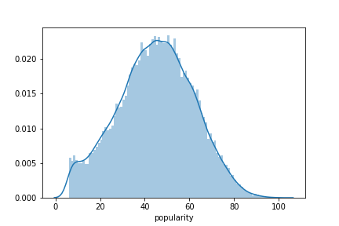
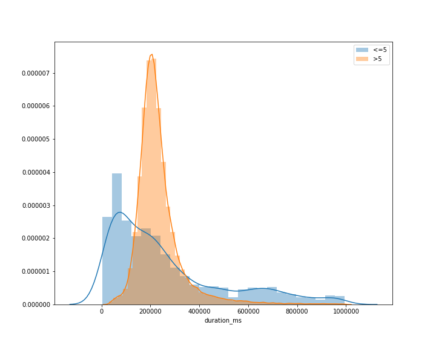

# KHOA HỌC DỮ LIỆU ỨNG DỤNG
---
**Đồ án cuối kỳ môn Khoa Học Dữ Liệu Ứng Dụng**

 **GV Hướng dẫn: Hoàng Xuân Trường**

## Thành Viên

* Nguyễn Phúc Khôi Nguyên - 1712106
* Nguyễn Thành Nhân - 1712631

## Tổng Quan Đồ Án

1. Đặt vấn đề
2. Thu thập dữ liệu
3. Khám phá và tiền xử lí dữ liệu
4. Phân tích dữ liệu $\rightarrow$ Thiết lập mô hình dự đoán
5. Tự đánh giá
6. Phân công
7. Hướng dẫn chạy

### Đặt vấn đề
> Gần đây diễn ra nhiều cuộc thi về âm nhạc, và câu hỏi đặt ra là làm sao để giám khảo có thể biết được chất lượng của bài hát đó thay vì cách nghe và cảm nhận (một cách khá cảm tính) như bình thường.

> Giả sử bạn là một nghệ sĩ và bạn cần một công cụ để đánh giá bài hát của mình đã tốt chưa, có khả quan và có được khán giả hứng thú. Nếu bài hát chưa hay thì chưa hay ở điểm nào và bạn có thể điều chỉnh được không?

**Các công cụ có thể trợ giúp việc đưa ra quyết định cho các giám khảo hoặc ca sĩ. Giúp họ điều chỉnh các thuộc tính của bài hát để có hiệu quả tốt. Ví dụ như ca sĩ nên lựa chọn thời lượng của bài hát là bao nhiêu để có thể thu hút nhiều người yêu thích  hoặc nên ưu tiên phát hành ở khu vực nào để có hiệu quả tốt nhất**

### Thu thập dữ liệu
> * Sử dụng `API` của Spotify, dịch vụ cung cấp âm nhạc kỹ thuật số nổi tiếng. ([link tham khảo](https://towardsdatascience.com/get-your-spotify-streaming-history-with-python-d5a208bbcbd3))
> * Thu thập danh sách id của các playlist có trên Spotify (Do API cung cấp) và lưu vào `playlist.csv`
> * Thu thập các id của các bài hát có trong danh sách playlist đã thu thập và lưu vào `tracks.txt`
> * Thu thập các id của nghệ sĩ (artists) của các bài hát đã thu thập và các thuộc tính của bài hát đó thông qua id đã thu thập trước đó và lưu vào `tracks.csv` và `feature.csv`
> * Thu thập thông tin của nghệ sĩ thông qua id và lưu vào `artists.csv`

$\rightarrow$ Dữ liệu được thu thập thành các file: `playList.txt`, `tracks.txt`, `artists.txt`, `./data/tracks.csv`, `./data/artists.csv`, `./data/feature.csv`
### Khám phá và tiền xử lí dữ liệu (EDA)

#### Khám phá dữ liệu
- Merge 2 dataframe feature và tracks thành dataframe cho bài hát `df_track`
- Khám phá trên 2 df: df_track và df_artist
- df_track có 69162 dòng và 23 thuộc tính, df_artist có 24544 dòng và 5 thuộc tính. Trong đó các thuộc tính được mô tả trong bảng sau:

- Đối với bộ dữ liệu này, chúng ta thực hiện dự đoán trên thuộc tính `popularity` của df_track để tìm hiểu về độ phổ biến đối với bài hát dựa vào các thuộc tính của tập dữ liệu.
##### Giải thích các cột trong df_track
|STT|Tên cột|Kiểu dữ liệu|Ý nghĩa|
|---|---|---|---|
|0  |artists |string|ID Spotify của các nghệ sĩ trình bày ca khúc, cách nhau bởi dấu "," |
|1  |available_markets   |string|Các khu vực trên thế giới có thể nghe bài hát, mỗi nước là một code 2 chữ in hoa, cách nhau bởi dấu ","|
|2  |explicit            |bool|True nếu bài hát chứa nội dung không phù hợp cho mọi đối tượng, ngược lại là False|
|3  |popularity          |int|Độ yêu thích, từ 0-100|
|4  |danceability        |float|Mức độ phù hợp của bài hát để nhảy, đo từ 0-1|
|5  |energy              |float|Mức độ sôi động của bài hát, đo từ 0-1|
|6  |key                 |int|Tông của bài hát, nếu không xác định, nhận giá trị là -1|
|7  |loudness            |float|Độ lớn db của bài hát từ -60 - 0|
|8  |mode                |int|1 cho biết bài hát viết theo "major", 0 là "minor"|
|9  |speechiness         |float|Từ 0-1, 0 có nghĩa bài hát không có lời, 1 có nghĩa bài hát có phần lời phức tạp|
|10 |acousticness        |float|Từ 0-1, khả năng bài hát có thể trình bày dưới dạng acoustic|
|11 |instrumentalness    |float|Từ 0-1, càng nhỏ cho thấy bài hát có phần lời ít|
|12 |liveness            |float|Từ 0-1, mức độ phù hợp để trình diễn trực tiếp|
|13 |valence             |float|Từ 0-1, mức độ tích cực của nội dung bài hát|
|14 |tempo               |float|Từ 0-1, độ nhanh của nhạc nền (số beat trên 1 phút)|
|15 |type            |string|Kiểu dữ liệu trả về khi gọi api, tất cả đều là "audio features"|
|16 |uri             |string|URI của bài hát|
|17 |track_href      |string|Link tới bài hát|
|18 |analysis_url    |string|Link tới phần đặc trưng âm thanh của bài hát|
|19 |duration_ms     |int|Độ dài bài hát|
|20 |time_signature  |int|Số beat của 1 câu trong bài hát|

##### Giải thích các cột trong df_artist
|STT|Tên cột|Kiểu dữ liệu|Ý nghĩa|
|---|---|---|---|
|0  |followers |int|Số người theo dõi|
|1  |genres   |string|Thể loại theo đuổi, có dạng một list các str|
|2  |name            |string|Tên nghệ sĩ|
|3  |popularity          |int|Độ yêu thích, từ 0-100|

#### Tiền xử lí dữ liệu
<!-- - Xóa các thuộc tính không phải số của df_track, trừ thuộc tính `available_markets` -->
- Xóa các mẫu có giá trị available_markets là null.
- Chia dữ liệu ra thành 3 tập train, develop, test.
### Phân tích dữ liệu -> Thiết lập mô hình dự đoán
- Xem xét phân phối của cột dữ liệu cần dự đoán (label) như thế nào
    
    
    $\rightarrow$ Dữ liệu tập trung nhiều ở khoảng gần 1, phần còn lại có hình dạng gần giống với phân phối chuẩn
- Xem xét phân phối của cột dữ liệu cần dự đoán (label) đã loại các dòng gần 0 (loại các dòng <= 5) như thế nào
    
    
    $\rightarrow$ Phân phối dữ liệu có hình dạng gần giống với phân phối chuẩn.

- Thời lượng tương ứng của các dữ liệu ứng với popularity <= 5 và phần còn lại phân phối như thế nào
    
    
    $\rightarrow$ Phân phối của thời lượng các mẫu dữ liệu có popularity > 5 gần giống với phân phối chuẩn, còn các mẫu có popularity <= 5 có thời lượng khá khác biệt với nhau. Có thể đây là các bài hát "rác" và có thể ảnh hưởng đến model
    
- Phân tích biến explicit

    

    $\rightarrow$ Có sự khác nhau đối ở độ yêu thích giữa đối với bài hát explicit và không explicit, các bài hát explicit có độ yêu thích lớn hơn đáng kế, có thể giữ explicit là một đặc trưng để dự đoán.


- Phân tích tương quan giữa các thuộc tính

    

    $\rightarrow$ Các cặp thuộc tính có tương quan lớn với nhau là (loudness, energy) và (acousticness, energy)
- Phân tích yếu tố khu vực phát hành ảnh hưởng thế nào đến Popularity
    

    $\rightarrow$ Ta thấy ở các khu đã xét, các bài hát được phát hành tại những nơi này có độ yêu thích trung bình lớn hơn so với trung bình những bài không được phát hành ở đây. Như vậy có thể xét các cột in_ME, in_RS, in_XK này khi tạo mô hình dự đoán

#### Thiết lập mô hình dự đoán
|Model|train_MSE|train_MAE|dev_MSE|dev_MAE|
|---|---|---|---|---|
|Linear Regression|275.6331|13.3665|277.8917|13.4155|
|Linear Regression + add_area3|266.7582|13.1435|270.1805|13.2106|
|Linear Regression + add_area5|264.3206|13.0903|268.4175|13.2063|
|Linear Regression + add_area5 + max_followers|241.4187|12.4382|247.9952|12.6072|
|Neural Network + add_area5 + max_followers|155.4821|9.6797|169.1587|10.1476|
|Random Forest + add_area5 + max_followers|21.4945|3.5134|147.8407| 9.3715|


### Tự đánh giá

1. Ứng dụng quy trình KHDL để trả lời cho câu hỏi dự đoán. (Hoàn thành)
2. Dùng Máy học để mô hình hóa dữ liệu. (Hoàn thành)
3. Tự thu thập dữ liệu để trả lời câu hỏi:
    - Sử dụng API: Hoàn thành
    - Sử dụng parse-HTML: Chưa hoàn thành
4. Đánh giá mức độ hoàn thành của các thành viên:
    - Nguyễn Phúc Khôi Nguyên: 100%
    - Nguyễn Thành Nhân: 100%

### Phân công
|Công việc|Thành Viên|Mức độ hoàn thành|
|---|---|---|
|Thu thập playlistID|Nguyên|100%|
|Thu thập trackID|Nhân|100%|
|Thu thập artistsID|Nhân|100%|
|Thu thập tracksInfo|Nguyên|100%|
|Thu thập audioFeature|Nguyên|100%|
|Khám phá và Phân tích dữ liệu|Nguyên|100%|
|Khám phá và Phân tích dữ liệu|Nhân|100%|
|Tiền xử lí dữ liệu|Nhân|100%|
|Tiền xử lí dữ liệu|Nguyên|100%|
|Mô hình hóa dữ liệu| Nguyên|100%|
### Hướng dẫn chạy
- Cài đặt thư viện Spotipy để sử dụng API
```bash
pip install spotipy
```
- Cách lấy token để sử dụng Spotify API
    - Đăng nhập vào link https://developer.spotify.com/
    - Vào thẻ Dashboard và chọn `Create an App`
    - Chọn Edit Setting và thay đổi Redirect URIs theo định dạng http://localhost:7777/callback
    - Cung cấp username, Client ID và Client Secret và Redirect URIs ở cho Spotipy (đã ghi chú trong file spotify.ipynb, spotify_crawl.ipynb
    
- Cách chạy lại các file Notebook: Chạy lại các file notebook theo thứ tự sau:
    1. Lấy thông tin token như hướng dẫn trên
    2. Sử thông tin token và chạy file `spotify.ipynb` để lấy các id và lưu xuống các file txt
    2. Chạy file `spotify_crawl.ipynb` để lấy các thông tin và lưu xuống csv
    3. Chạy file `analysis.ipynb` và `modeling.ipynb` để phân tích và mô hình hóa dữ liệu
    
- Cách sử dụng model để dự đoán dự trên các giá trị
    - cài đặt thư viện joblib
    - Dùng hàm joblib.dump để lưu lại model sau khi train
    - Dùng hàm joblib.load để load model đã được lưu
    - Ví dụ dự đoán popularity của một bài hát
        ```python
               import joblib
               model = joblib.load(f'{MODEL_DIR}')
               # Dự đoán popularity của một bài hát
               ## Giả sử bài hát có data như sau:
               '''
                explicit                  False
                danceability              0.388
                energy                  0.00843
                key                           9
                loudness                -31.898
                mode                          0
                speechiness               0.054
                acousticness              0.994
                instrumentalness          0.919
                liveness                 0.0861
                valence                   0.179
                tempo                   114.314
                duration_ms              453267
                time_signature                4
                followers           3.57022e+06
               '''
                # Input của model là mảng 2 chiều, có shape = (1,15)
                popularity = model.predict([[False,
                                0.38799999999999996,
                                0.00843,
                                9,
                                -31.898000000000003,
                                0,
                                0.054000000000000006,
                                0.9940000000000001,
                                0.919,
                                0.0861,
                                0.179,
                                114.314,
                                453267,
                                4,
                                3.57022e+06]])[0]     
        ```
        
    - Link model đã train sẵn: [model](https://drive.google.com/file/d/1NFEbDukDco6UMAZ796a1PSHX91nUphUJ/view?fbclid=IwAR0Zhe_0kOCWP0lSCFSgoC4xJLx881s4KerC-Mg31iMjxzYqYLE9QraN_oE)
